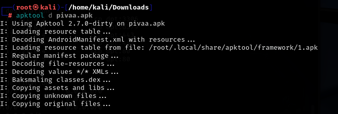
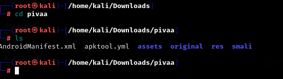
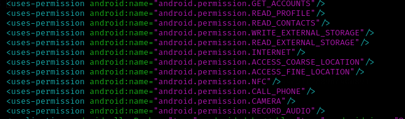
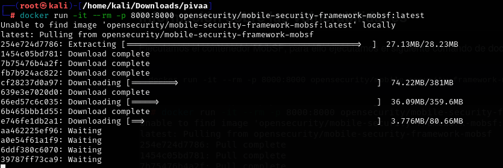
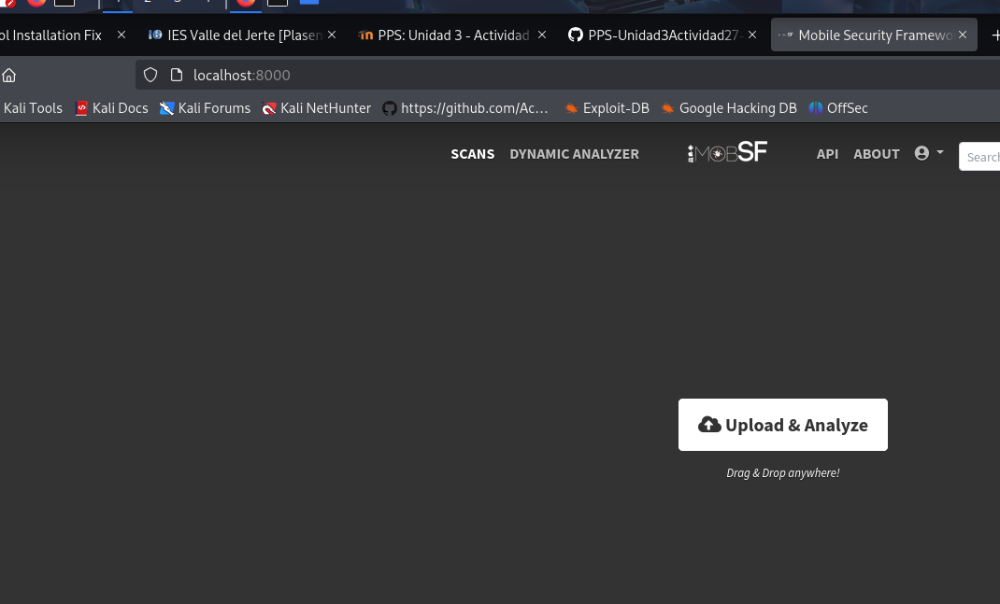
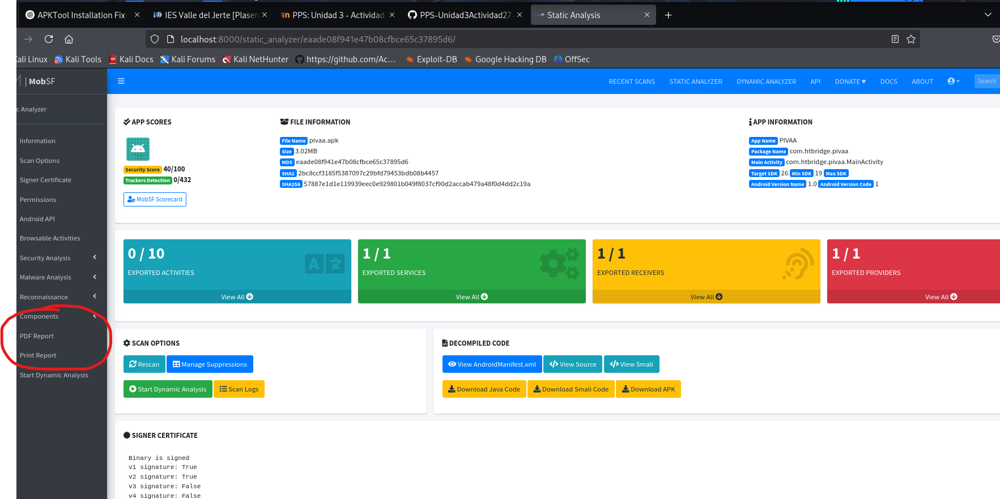
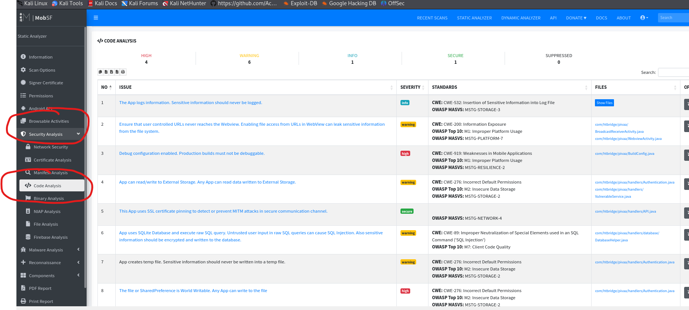
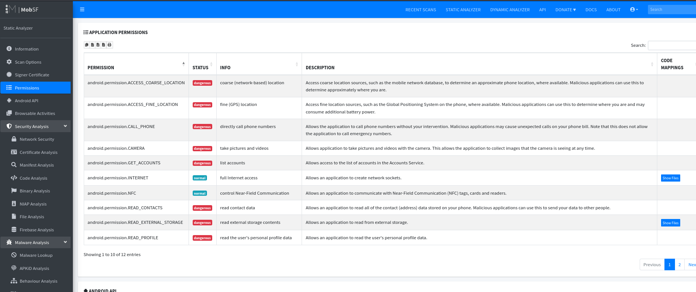

# PPS-Unidad3Actividad27-Analisis-estatico-MobSF-Raul_Albalat

Extrae la app Pivaa con la utilidad apktool (apktool d aplicación.apk)

## Paso 1 descarga pivaa.apk

Lo primero que hacemos será descargarnos la apk con el comando `apktool -d pivaa.apk`.



Se generará una carpeta llamada `pivaa/` que contiene los archivos descompilados, incluyendo el`AndroidManifest.xml.`




## Paso 2  información de permisos

Abrimos `AndroidManifest.xml.` y podemos ver los permisos que tiene entre los que se encuentra



- Acceso a cuentas de usuario
- Leer perfiles de usuario
- Acceso a los contactos
- Permisos de esritura en la unidad de almacenamiento
- Permisos lectura en la unidad de almacenamiento
- Acceso a internet
- Acceso a la ubicación aproximada del dispositivo
- Uso de NFC
- Acceso a las llamadas de teléfono
- Acceso a la cámara
- Acceso a la grabación de audio

## Paso 3  Levantar MobSF con Docker


Ejecutamos el contenedor docker de  MobSF, ejecutando el siguiente comando:

```
docker run -it --rm -p 8000:8000 opensecurity/mobile-security-framework-mobsf:latest
```



Una vez cargado el contenedor. acedemos por la url ` http://localhost:8000` y para ello introducimos las credenciales `username:mobsf` y `Password:mobsf`.




## Paso 4

Una vez estamos dentro tenemos que mover el archivo pivaa.apk y con esto nos saldrá un informe el cual podemos obtener un `pdf`del menú.



Guardamos el `Informe_mobsf_pivaa.pdf`para adjuntarlo en la actividad.

## Paso 5 

Tambien dentro del dashboard de `Mobsf` podemos consultar en la menú lateral, concretamente en `Security Analysis` ---> `Code Analysis` encontramos las vulnerabilidades con su clasificacón de severidad.



## Información de permisos dentro de Mobsf

También podemos ver los permisos dentro de `Mobsf` en el menú lateral, en `Permissions`.




